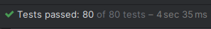
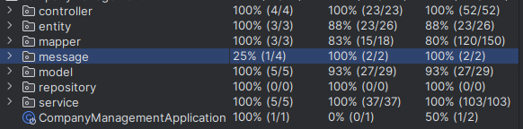

## 1 Описание предметной области

**Предметная область: Управление компаниями, департаментами и сотрудниками**

**Company (Компания):**

- Идентифицирует компанию и её свойства.
- Содержит информацию о названии, описании и дате создания компании.
- Связана с департаментами через отношение один-ко-многим.

**Department (Департамент):**

- Идентифицирует департамент и его свойства.
- Содержит информацию о названии, описании и ежегодном бюджете департамента.
- Связан с компанией через отношение многие-к-одному.
- Связан с сотрудниками через отношение один-ко-многим.

**Employee (Сотрудник):**

- Идентифицирует сотрудника и его свойства.
- Содержит информацию об имени, фамилии, должности, возрасте, электронной почте, дате трудоустройства и зарплате
  сотрудника.
- Связан с департаментом через отношение многие-к-одному.

Приложение предоставляет проводить CRUD-операции над всеми объектами с учетом их связей.

### **Документация Swagger-UI доступна при запуске приложения по url `/swagger-ui.html`**
### **Со скриптами БД можно ознакомится [тут](/src/main/resources/db/changelog/scripts)**

## 2 Использованные технологии

| Область применения    | Технологии                                         |
|-----------------------|----------------------------------------------------|
| Язык программирования | Java                                               | ☕
| Система сборки        | Gradle                                             | 
| База данных           | PostgreSQL                                         |
| Управление миграциями | Liquibase                                          |
| Backend-фреймворк     | Spring Boot                                        | 
| ORM-фреймворк         | Hibernate                                          | 
| Тестирование          | JUnit 5, AssertJ, Mockito, MockMvc, Testcontainers | 
| Контейнеризация       | Docker                                             | 

## 3 Описание использованных зависимостей

1. `org.springframework.boot:spring-boot-starter-data-jpa`: Данная зависимость предоставляет стартер для подключения и использования JPA (Java Persistence API) в Spring Boot приложении. Она включает в себя необходимые компоненты для работы с базой данных и выполнения операций над сущностями.

2. `org.springframework.boot:spring-boot-starter-web`: Эта зависимость предоставляет стартер для разработки веб-приложений с использованием Spring MVC. Она включает в себя компоненты, необходимые для создания веб-сервисов и обработки HTTP-запросов.

3. `org.springframework.boot:spring-boot-starter-validation`: Данная зависимость предоставляет стартер для включения поддержки валидации данных в Spring Boot приложении. Она включает в себя компоненты и аннотации для определения правил проверки и проверки данных.

4. `org.springdoc:springdoc-openapi-starter-webmvc-ui:2.1.0`: Эта зависимость предоставляет интеграцию Spring Boot с OpenAPI (ранее известным как Swagger). Она позволяет автоматически генерировать документацию API на основе аннотаций в коде.

5. `org.liquibase:liquibase-core`: Данная зависимость предоставляет инструмент для управления миграциями базы данных. Liquibase позволяет определять и применять изменения схемы базы данных в контролируемой и автоматизированной манере.

6. `org.projectlombok:lombok`: Lombok - это библиотека, которая помогает упростить разработку Java-кода. Она предоставляет аннотации, которые автоматически генерируют стандартные методы, такие как геттеры, сеттеры, конструкторы и другие, уменьшая объем кода.

7. `org.springframework.boot:spring-boot-devtools`: Эта зависимость предоставляет набор инструментов для разработки, которые помогают в автоматическом перезапуске приложения при изменениях и обеспечивают более быструю разработку.

8. `org.springframework.boot:spring-boot-docker-compose`: Данная зависимость предоставляет инструменты для работы с Docker Compose во время разработки приложения. Она позволяет определить и запустить множество контейнеров Docker в рамках одной среды разработки.

9. `org.postgresql:postgresql`: Эта зависимость предоставляет драйвер JDBC для подключения к PostgreSQL базе данных. Она позволяет взаимодействовать с базой данных PostgreSQL из Java-приложения.

10. `org.springframework.boot:spring-boot-configuration-processor`: Данная зависимость предоставляет процессор аннотаций, который генерирует метаданные о настройках приложения, определенных с помощью аннотаций `@ConfigurationProperties`. Это упрощает работу с настройками конфигурации.

11. `org.mapstruct:mapstruct:1.5.5.Final`: Эта зависимость предоставляет библиотеку MapStruct, которая автоматически генерирует код преобразования объектов между различными слоями приложения.

12. `org.projectlombok:lombok-mapstruct-binding:0.2.0`: Данная зависимость предоставляет интеграцию между Lombok и MapStruct, что упрощает создание мапперов для преобразования объектов.

13. `org.mapstruct:mapstruct-processor:1.5.5.Final`: Эта зависимость предоставляет процессор аннотаций для MapStruct, который генерирует реализацию мапперов во время компиляции.

14. `org.springframework.boot:spring-boot-starter-test`: Данная зависимость предоставляет стартер для модуля тестирования Spring Boot приложений. Она включает в себя необходимые компоненты для написания и выполнения тестов.

15. `org.springframework.boot:spring-boot-testcontainers`: Эта зависимость предоставляет интеграцию Spring Boot с Testcontainers, что позволяет запускать изолированные контейнеры Docker для тестирования.

16. `org.testcontainers:junit-jupiter`: Данная зависимость предоставляет интеграцию Testcontainers с JUnit 5, что облегчает использование контейнеров Docker в тестах.

17. `org.testcontainers:postgresql`: Эта зависимость предоставляет контейнер Docker для PostgreSQL, который можно использовать во время тестирования для запуска изолированной базы данных.

## 4 Запуск приложения
**Важно:** для запуска необходим Docker

**Linux & MacOS:**
1. Склонировать репозиторий к себе на компьютер
2. Перейти в папку с проектом
3. Запустить файл start.sh, который лежит в корне проекта, после чего запустится контейнер с Postgres и контейнер с приложением.
4. Если вдруг возникли проблемы с запуском скрипта, можно просто собрать проект с помощью команды `./gradlew build` и потом запустить контейнеры с помощью команды `docker-compose up`

**Windows:**
1. Склонировать репозиторий к себе на компьютер
2. Перейти в папку с проектом
3. Выполнить команду `gradlew.bat build`
4. Выполнить команду docker-compose up, после чего запустится контейнер с Postgres и контейнер с приложением.

## 5 API

### Companies

| HTTP-метод | URL                           | Назначение                                                       |
|------------|-------------------------------|------------------------------------------------------------------|
| GET        | /api/v0/companies/{companyId} | Получить информацию о конкретной компании                        | 
| GET        | /api/v0/companies             | Получить список компаний c пагинацией и опциональной сортировкой |
| POST       | /api/v0/companies             | Создать новую компанию                                           |
| PUT        | /api/v0/companies/{companyId} | Обновить информацию о конкретной компании                        |
| PATCH      | /api/v0/companies/{companyId} | Частично изменить информацию о конкретной компании               |
| DELETE     | /api/v0/companies/{companyId} | Удалить конкретную компанию                                      |

#### 1. Получить информацию о конкретной компании
```
curl -X GET "http://localhost:8080/api/v0/companies/1"
```
#### 2. Получить список компаний c пагинацией и опциональной сортировкой
```
curl -X GET "http://localhost:8080/api/v0/companies?page=0&size=10&sort=dateOfCreation,asc"
```
#### 3. Создать новую компанию
```
curl -X POST "http://localhost:8080/api/v0/companies" -H "Content-Type: application/json" -d '{
  "name": "Acme Corporation",
  "description": "A multinational conglomerate",
  "dateOfCreation": "2000-01-01"
}'
```
#### 4. Обновить информацию о конкретной компании
```
curl -X PUT "http://localhost:8080/api/v0/companies/2" -H "Content-Type: application/json" -d '{
  "name": "Updated Company Name",
  "description": "Updated company description",
  "dateOfCreation": "2005-06-30"
}'
```

#### 5. Частично изменить информацию о конкретной компании
```
curl -X PATCH "http://localhost:8080/api/v0/companies/3" -H "Content-Type: application/json" -d '{
  "description": "Updated company description"
}'
```

#### 6. Удалить конкретную компанию
```
curl -X DELETE "http://localhost:8080/api/v0/companies/1"
```

### Departments

| HTTP-метод | URL                                                      | Назначение                                                                |
|------------|----------------------------------------------------------|---------------------------------------------------------------------------|
| GET        | /api/v0/companies/{companyId}/departments/{departmentId} | Получить информацию о конкретном отделе                                   |
| GET        | /api/v0/companies/{companyId}/departments                | Получить список отделов в компании c пагнацией и опциональной сортировкой |
| POST       | /api/v0/companies/{companyId}/departments                | Создать новый отдел в компании                                            |
| PUT        | /api/v0/companies/{companyId}/departments/{departmentId} | Обновить информацию о конкретном отделе                                   |
| PATCH      | /api/v0/companies/{companyId}/departments/{departmentId} | Частично изменить информацию о конкретном отделе                          |
| DELETE     | /api/v0/companies/{companyId}/departments/{departmentId} | Удалить конкретный отдел                                                  |

#### 1. Получить информацию о конкретном отделе
```
curl -X GET "http://localhost:8080/api/v0/companies/1/departments/1" -H "Content-Type: application/json"
```
#### 2. Получить список отделов в компании c пагнацией и опциональной сортировкой
```
curl -X GET "http://localhost:8080/api/v0/companies/{companyId}/departments?page=0&size=10&sort=name,asc" -H "Content-Type: application/json"
```
#### 3. Создать новый отдел в компании
```
curl -X POST "http://localhost:8080/api/v0/companies/1/departments" -H "Content-Type: application/json" -d '{
  "name": "Sales",
  "description": "Handles sales operations",
  "annualBudget": 1000000.00
}'
```
#### 4. Обновить информацию о конкретном отделе
```
curl -X PUT "http://localhost:8080/api/v0/companies/1/departments/1" -H "Content-Type: application/json" -d '{
  "name": "New Sales Name",
  "description": "New description",
  "annualBudget": 1500000.00
}'
```
#### 5. Частично изменить информацию о конкретном отделе
```
curl -X PATCH "http://localhost:8080/api/v0/companies/1/departments/2" -H "Content-Type: application/json" -d '{
  "name": "New Sales Name"
}'

```
#### 6. Удалить конкретный отдел
```
curl -X DELETE "http://localhost:8080/api/v0/companies/1/departments/1" -H "Content-Type: application/json"
```

### Employees

| HTTP-метод | URL                                                                             | Назначение                                                      |
|------------|---------------------------------------------------------------------------------|-----------------------------------------------------------------|
| GET        | /api/v0/companies/{companyId}/departments/{departmentId}/employees/{employeeId} | Получить информацию о сотруднике по его идентификатору          |
| GET        | /api/v0/companies/{companyId}/departments/{departmentId}/employees              | Получить список сотрудников отдела                              |
| POST       | /api/v0/companies/{companyId}/departments/{departmentId}/employees              | Создать нового сотрудника в отделе                              |
| PUT        | /api/v0/companies/{companyId}/departments/{departmentId}/employees/{employeeId} | Обновить информацию о сотруднике по его идентификатору          |
| PATCH      | /api/v0/companies/{companyId}/departments/{departmentId}/employees/{employeeId} | Частично изменить информацию о сотруднике по его идентификатору |
| DELETE     | /api/v0/companies/{companyId}/departments/{departmentId}/employees/{employeeId} | Удалить сотрудника по его идентификатору                        |

Конечно! Вот несколько примеров curl-запросов для каждого из эндпоинтов:

#### 1. Получение списка сотрудников с пагинацией:
```bash
curl -X GET '/api/v0/companies/1/departments/1/employees?page=0&size=10'
```
#### 2. Получение конкретного сотрудника:
```bash
curl -X GET '/api/v0/companies/{companyId}/departments/{departmentId}/employees/{id}'
```
#### 3. Создание нового сотрудника:
```bash
curl -X POST '/api/v0/companies/1/departments/1/employees' \
-H 'Content-Type: application/json' \
-d '{
  "firstname": "John",
  "lastname": "Kio",
  "position": "Manager",
  "age": 30,
  "email": "john.kio@example.com",
  "dateOfEmployment": "2022-01-01",
  "salaryPerMonth": 5000.00
}'
```
#### 4. Обновление сотрудника:
```bash
curl -X PUT '/api/v0/companies/1/departments/2/employees/1' \
-H 'Content-Type: application/json' \
-d '{
  "firstname": "UpdatedFirstName",
  "lastname": "UpdatedLastName",
  "position": "UpdatedPosition",
  "age": 35,
  "email": "updated.email@example.com",
  "dateOfEmployment": "2022-02-01",
  "salaryPerMonth": 5500.00
}'
```
### 5. Частичное обновление сотрудника:
```bash
curl -X PATCH '/api/v0/companies/{companyId}/departments/{departmentId}/employees/{employeeId}' \
-H 'Content-Type: application/json' \
-d '{
  "lastname": "UpdatedLastName",
  "age": 35
}'
```
#### 6. Удаление сотрудника:
```bash
curl -X DELETE '/api/v0/companies/1/departments/1/employees/1'
```

## 6 Тестирование
Тестирование сервисного слоя производилось изолированно с использованием юнит-тестов, в которых применялись библиотеки Mockito и AssertJ.

Для тестирования взаимодействия всех слоев приложения были написаны интеграционные тесты.
При запуске интеграционных тестов запускается контейнер с базой Postgres, на которую накатываются DDL и DML скрипты Liquibase.
В этих тестах использовались библиотеки TestContainers и MockMvc.

 

